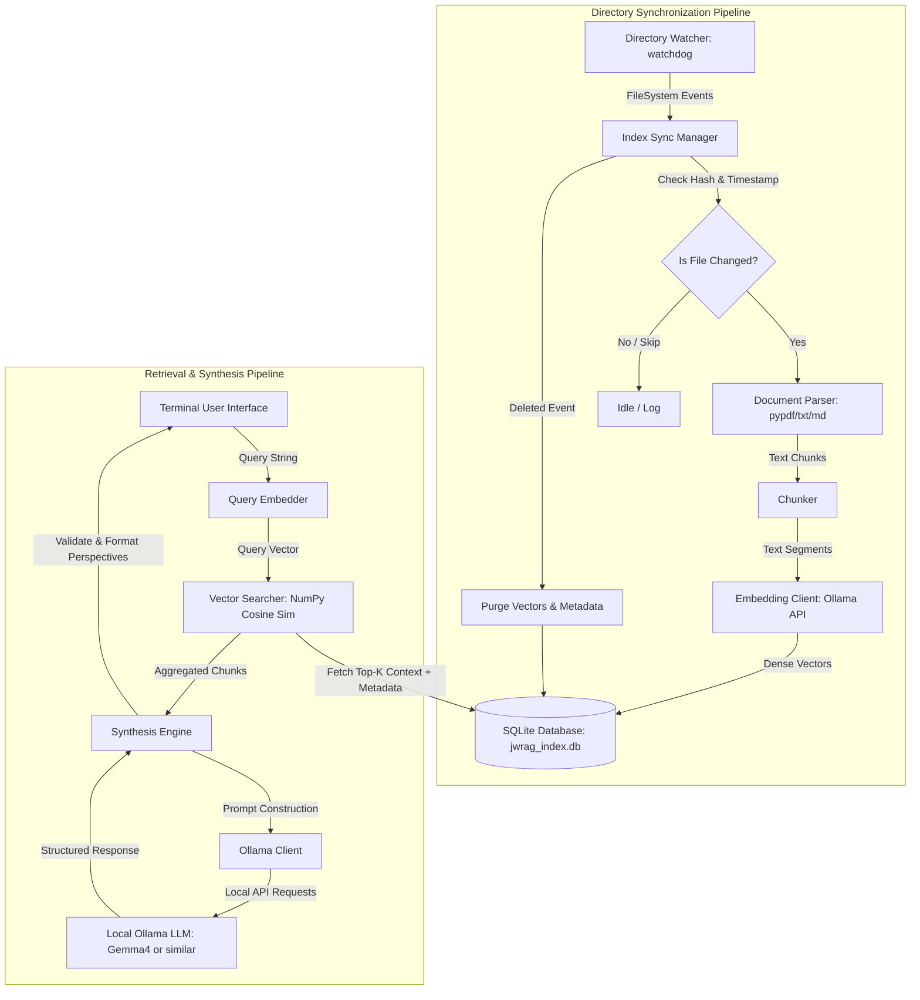

# JWRAG: Judgment-Weighted Retrieval-Augmented Generation

A 100% localized, air-gapped decision support system that watches a local directory of sensitive documents and securely indexes them. Rather than returning flat answers, JWRAG synthesizes multi-perspective analytical options (alternative judgments) grounded in verifiable file citations, with absolute guarantees of zero data egress.

---

## 📖 Table of Contents
- [Overview](#overview)
- [Architecture & Core Principles](#architecture--core-principles)
- [Prerequisites](#prerequisites)
- [Installation & Setup](#installation--setup)
- [Detailed Manual](#detailed-manual)
    - [1. Directory Synchronization Pipeline](#1-directory-synchronization-pipeline)
    - [2. Interactive Querying (TUI)](#2-interactive-querying-tui)
    - [3. Synthesis Engine Behavior](#3-synthesis-engine-behavior)
    - [4. Data Privacy & Air-Gapped Execution](#4-data-privacy--air-gapped-execution)
    - [5. Configuration & Customization](#5-configuration--customization)
- [Troubleshooting](#troubleshooting)
- [License](#license)

---

## Overview
JWRAG is designed for professionals managing highly sensitive, proprietary data who require private, offline decision-making support. It eliminates cloud-based RAG risks by running entirely on local hardware, leveraging a local Ollama server for embeddings and LLM inference, and maintaining a strict SQLite vector index.

**Key Capabilities:**
- Real-time document monitoring and automatic re-indexing.
- Multi-perspective synthesis (e.g., Conservative vs. Progressive options).
- Verifiable file citations appended to every response.
- Strict air-gapped execution with zero external network calls.

---

## Architecture & Core Principles
JWRAG follows a modular, spec-driven architecture built on strict TDD and SDD methodologies. The system is divided into two primary pipelines: the **Directory Synchronization Pipeline** for automated indexing and the **Retrieval & Synthesis Pipeline** for interactive querying.



Key architectural components include:
- **Directory Watcher:** Uses `watchdog` to monitor a target folder for file events (`created`, `modified`, `deleted`).
- **Sync Manager:** Computes file hashes to detect changes, triggering upsert or delete sequences in the SQLite database.
- **Document Parser:** Extracts text from `.txt`, `.md`, and searchable `.pdf` files using `pypdf`.
- **Chunker:** Splits extracted text into 1024-character segments with 150-200 character overlap, preserving hierarchical separators.
- **Vector Store:** Stores document metadata and embedding BLOBs in SQLite, performing cosine similarity search natively via `numpy`.
- **Synthesis Engine:** Queries a local Ollama model (`gemma4:26b-mlx` or similar) to generate structured JSON containing multiple judgment perspectives.
- **TUI Renderer:** Formats query inputs, synthesized options, and references into a clean terminal interface.

---

## Prerequisites
Before running JWRAG, ensure your environment meets the following requirements:
- **Python 3.12+** installed and accessible via CLI.
- **`uv`** package manager installed (`pip install uv`).
- **Ollama** daemon running locally with at least one embedding model (e.g., `qwen3-embedding:4b`) and one synthesis model (e.g., `gemma4:26b-mlx`).
- A local directory containing raw documents (`.txt`, `.md`, `.pdf`).

---

## Installation & Setup
1. **Clone or extract the project repository.**
2. **Install dependencies using `uv`:**
     ```bash
    uv sync
     ```
3. **Download required models for Ollama:**
   Ensure your local Ollama server is running, then pull the necessary models:
     ```bash
    ollama pull qwen3-embedding:4b
    ollama pull gemma4:26b-mlx
     ```
4. **Run the application:**
     ```bash
    uv run python -m jwrag.main
     ```
   *(Note: The `./documents` directory will be created automatically upon first run. Place your `.txt`, `.md`, or `.pdf` files in this directory to have them indexed).*

---

## Detailed Manual

### 1. Directory Synchronization Pipeline
JWRAG continuously monitors a designated document directory for file system events. The synchronization pipeline operates as follows:
- **New Files:** Automatically parsed, chunked, embedded, and indexed into the SQLite database.
- **Modified Files:** Hash comparison detects changes. Old vectors are purged, and new embeddings are generated and upserted.
- **Deleted Files:** Corresponding document records and vector chunks are immediately removed from the index.

**Configuration:**
The watched directory is defined in `jwrag/main.py` under the `run()` function:
```python
doc_dir = Path("./documents")
```
Update this path to point to your local repository of sensitive documents. The `IndexSyncManager` class handles hash computation and state tracking, while `DirectoryWatcher` bridges OS-level events to the application logic.

### 2. Interactive Querying (TUI)
Once the application starts, you will be presented with a terminal prompt (`> `). 
- **Enter a query:** Type your question and press `Enter`. The system will embed the query, retrieve top-K similar chunks, and request multi-perspective synthesis from the local LLM.
- **View Output:** Results are displayed in structured blocks:
    - `--- Query ---`
    - `--- Options ---` (Multiple distinct judgment perspectives)
    - `--- References ---` (Source filenames)
- **Exit:** Type `exit` or `quit` to gracefully terminate the application and stop the directory watcher.

The `TUIRenderer` class formats these outputs, ensuring clean separation between query context, synthesized options, and source references.

### 3. Synthesis Engine Behavior
The core value of JWRAG lies in its "Exercise Judgment" engine. Instead of returning a single factual answer, the LLM is prompted to:
1. Analyze aggregated document context.
2. Generate at least two distinct, non-identical judgment options (e.g., Option A: Conservative/Compliance-first, Option B: Progressive/Efficiency-first).
3. Provide detailed reasoning and key conclusions for each option.
4. Strictly reference only the provided context.

The engine includes a robust JSON parsing pipeline with automatic retries to handle LLM output formatting drift, ensuring reliable structured responses even when the model deviates from expected markdown fences. If parsing fails after 2 retries, a hard fallback returns a "Parsing Failure" option.

### 4. Data Privacy & Air-Gapped Execution
JWRAG is engineered for absolute privacy:
- **Zero Egress:** All embeddings, vector storage, and LLM inference occur locally via `http://localhost:11434`. No external APIs or cloud services are contacted.
- **Local SQLite Index:** Metadata and BLOB embeddings are stored in a single local database (`jwrag_index.db`).
- **Defensive Parsing:** The system gracefully handles missing files, corrupted PDFs, and malformed LLM responses without crashing or leaking data.

### 5. Configuration & Customization
You can customize the Ollama models and base URL by modifying the `OllamaSynthesisEngine` initialization in `jwrag/main.py`:
```python
self.engine = OllamaSynthesisEngine(
    base_url="http://localhost:11434",
    embedding_model="qwen3-embedding:4b",
    synthesis_model="gemma4:26b-mlx"
)
```
Adjust these parameters to match your local Ollama environment and available models.

---

## Troubleshooting
| Issue | Cause | Resolution |
|-------|-------|------------|
| `Ollama connection refused` | Ollama daemon not running | Start the Ollama service locally. Verify it responds to `http://localhost:11434/api/tags`. |
| `IndexError: list index out of range` during synthesis | LLM returned empty or malformed JSON | Check logs for raw LLM output. Ensure your local model supports structured JSON output. Retry the query. |
| Documents not indexing automatically | Watchdog event handler misconfigured | Verify `doc_dir` path exists and contains readable files. Check terminal logs for sync events. |
| Slow query response | Large context window or heavy LLM model | Reduce document count or use a smaller local model (e.g., `gemma2:9b`). Optimize chunk overlap settings in `chunker.py`. |

---

## License
This project is licensed under the GNU General Public License v3.0 (GPLv3). See the `LICENSE` file for details.
