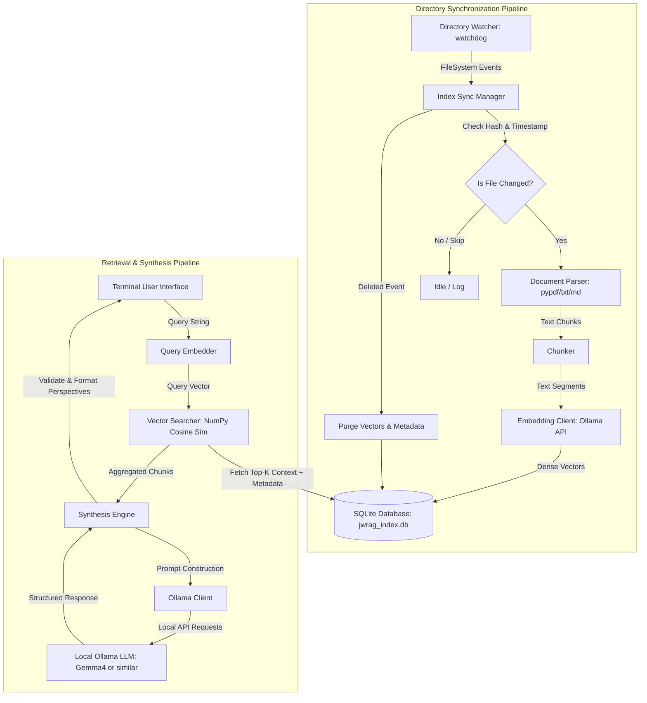

# JWRAG Technical Specifications

## System Overview

JWRAG (Judgment-Weighted Retrieval-Augmented Generation) is a 100% localized, air-gapped decision support system that reads, watches, and indexes sensitive text documents (.txt, .md, searchable .pdf) from a local raw document directory. It provides a secure, private interface through which users can query their repository and receive multi-perspective synthesized analysis (alternative judgments) instead of a single, flat answer, accompanied by strict, verifiable citations.

The core value proposition of JWRAG includes:
1. **Absolute Privacy:** Zero data egress. Embeddings, database indices, parser pipelines, and Large Language Model (LLM) inference run exclusively on the local machine (using a local Ollama server).
2. **Automated Synchronization:** Background directory watching automatically detects when files are created, modified, or deleted and reflects these changes in the index instantly without requiring a system restart.
3. **Multi-Perspective Synthesis ("Exercise Judgment" Engine):** Rather than standard QA retrieving a single fact, JWRAG aggregates document context and uses the LLM to output at least two distinct, contrasting options or lines of reasoning (e.g., Option A: Conservative/Compliance-first, Option B: Progressive/Efficiency-first).
4. **Verifiable References:** Explicit file citations appended to every response, pointing back directly to the source documents.

---

## Architecture Diagram

The system follows a modular architecture consisting of the **Directory Synchronization Pipeline** and the **Retrieval & Synthesis Query Pipeline**.



---

## Data Design

JWRAG stores all metadata and vector embeddings locally inside a single SQLite database (`jwrag_index.db`). Storing both structured document records and vector arrays (as raw byte blobs) in a single SQLite instance simplifies dependency management and transactional integrity.

### SQLite Schema

```sql
-- Track documents in the watched directory
CREATE TABLE IF NOT EXISTS documents (
    id TEXT PRIMARY KEY,                -- UUID or normalized relative path
    filepath TEXT UNIQUE NOT NULL,      -- Absolute or relative file path
    filename TEXT NOT NULL,             -- Base name of the file
    file_hash TEXT NOT NULL,            -- MD5/SHA256 checksum to detect changes
    last_modified REAL NOT NULL,        -- Unix timestamp of last modification
    indexed_at REAL NOT NULL            -- Timestamp of last indexing
);

-- Store document chunks and their associated vector embeddings
CREATE TABLE IF NOT EXISTS document_chunks (
    id TEXT PRIMARY KEY,                -- Unique chunk ID (e.g., doc_id_index)
    document_id TEXT NOT NULL,          -- Foreign key referencing documents.id
    chunk_index INTEGER NOT NULL,       -- Ordering index of chunk in document
    text_content TEXT NOT NULL,         -- Actual text segment
    embedding BLOB NOT NULL,            -- Serialized float array (e.g. np.ndarray.tobytes())
    metadata TEXT NOT NULL,             -- JSON string storing arbitrary metadata (page, etc.)
    FOREIGN KEY (document_id) REFERENCES documents (id) ON DELETE CASCADE
);

-- Create index for quick chunk lookups by document
CREATE INDEX IF NOT EXISTS idx_chunks_document ON document_chunks(document_id);
```

### Data Transfer Objects (DTOs)
The system will pass data between modules using immutable Python `dataclasses`.

```python
import dataclasses
from pathlib import Path
from typing import Dict, Any, List, Optional
import numpy as np

@dataclasses.dataclass(frozen=True)
class DocumentMetadata:
    id: str
    filepath: Path
    filename: str
    file_hash: str
    last_modified: float

@dataclasses.dataclass(frozen=True)
class Chunk:
    id: str
    document_id: str
    chunk_index: int
    text_content: str
    embedding: np.ndarray
    metadata: Dict[str, Any]

@dataclasses.dataclass(frozen=True)
class SynthesisOption:
    title: str
    reasoning: str
    conclusions: List[str]

@dataclasses.dataclass(frozen=True)
class Reference:
    filename: str
    markers: Dict[str, str] = dataclasses.field(default_factory=dict)

@dataclasses.dataclass(frozen=True)
class SynthesisResult:
    query: str
    options: List[SynthesisOption]
    references: List[Reference]
```

---

## Modeling Approach

To maintain a strict offline, air-gapped status, JWRAG utilizes local embedding and LLM inference models via a local Ollama server interface.

### 1. Local Embedding Model
- **Model:** `qwen3-embedding:4b` or `bge-me:latest` defined through parametrization.
- **Dimension:** 2048 dimensions.
- **Integration:** Embeddings are requested via Ollama's local HTTP API `/api/embeddings` or `/api/embed`.
- **Retrieval:** Cosine similarity calculation is implemented locally in Python using `numpy` over the fetched embeddings BLOBs from the SQLite database.

### 2. Context Ingestion & Chunking
- **Text Parsing:** 
   - Standard text (`.txt`) and Markdown (`.md`) files are read as raw UTF-8.
   - Searchable PDFs (`.pdf`) are parsed using `pypdf` to extract raw text blocks page-by-page. If native `page_labels` metadata is missing, a heuristic text scanner extracts printed page numbers from headers and footers.
- **Chunking Strategy:** 
   - Chunk Size: 1,024 characters (approx.   250–300 tokens). 
   - Recommended Overlap: 150–200 characters (approx.   15–20%). 
   - Separators: Maintain the hierarchy ["\n\n", "\n", ". ", " ", ""] to prioritize splitting at paragraphs and sentences before forcing a character count cut. 
- **Metadata Tagging:** Each chunk is tagged with its source file path, name, hash, and dynamically extracted positional markers (e.g., page, paragraph, chapter, section).

### 3. Judgment Synthesis (LLM)
- **Model:** Local Ollama model configured via environment variable; default to `gemma4:26b-mlx`.
- **Prompt Architecture:** The synthesis prompt directs the LLM to structure its output into distinct judgment perspectives.

```
You are JWRAG (Judgement Weighted RAG), a local multi-perspective decision-support engine. 
Analyze the provided document context below to answer the user's query.

INSTRUCTIONS:
1. Provide at least two distinct, non-identical judgment options or perspectives (e.g. Option A: Conservative, Option B: Progressive).
2. For each option, specify:
    - A descriptive Title.
    - Detailed Reasoning based on the text.
    - Key Conclusions or actions.
3. Reference ONLY the provided context. If the context does not contain enough information, explain that.
4. Format your output strictly in JSON according to this structure:
{
   "options": [
     {
       "title": "Option Title",
       "reasoning": "Detailed justification...",
       "conclusions": ["Conclusion 1", "Conclusion 2"]
     }
   ],
   "references": [
     {
       "filename": "document_name.pdf",
       "markers": {
         "page": "12",
         "paragraph": "3"
       }
     }
   ]
}
5. Populate the `references` array using the metadata provided in the CONTEXT blocks. Include the document name and any location markers (e.g., chapter, page, paragraph) for each cited source.

---
CONTEXT:
(Each chunk will be prefixed with [Document: {filename}, Markers: {markers}])
{context_text}
---
USER QUERY:
{query_text}
```

---

## Interfaces / APIs

Every module is designed around abstract interfaces (`abc.ABC`) to support swappable components and rigid Test-Driven Development (TDD).

### 1. Document Watcher & Synchronizer
```python
import abc
from pathlib import Path
from typing import Callable

class IDirectoryWatcher(abc.ABC):
     @abc.abstractmethod
    def start(self, directory_path: Path, callback: Callable[[str, Path], None]) -> None:
         """Starts watching the target directory. Triggers callback on file events.
        
        Args:
            directory_path: The Path of the directory to monitor.
            callback: Function to invoke. Signature: callback(event_type: str, file_path: Path)
                      event_type can be 'created', 'modified', or 'deleted'.
         """
        pass

     @abc.abstractmethod
    def stop(self) -> None:
         """Stops watching the directory."""
        pass
```

### 2. Document Parser
```python
class IDocumentParser(abc.ABC):
     @abc.abstractmethod
    def can_parse(self, filepath: Path) -> bool:
         """Checks if this parser supports the file extension."""
        pass

     @abc.abstractmethod
    def extract_text_with_metadata(self, filepath: Path) -> List[Dict[str, Any]]:
         """Extracts text content and metadata from the document.
        
        Returns:
            A list of dicts, each representing a page or section:
             [{"text": "page/section text", "page_number": 1, ...}]
         """
        pass
```

### 3. Vector Database / Store
```python
class IVectorStore(abc.ABC):
     @abc.abstractmethod
    def initialize(self) -> None:
         """Sets up database tables and schemas."""
        pass

     @abc.abstractmethod
    def upsert_document(self, doc: DocumentMetadata, chunks: List[Chunk]) -> None:
         """Saves or updates document metadata and its associated chunks in a single transaction."""
        pass

     @abc.abstractmethod
    def delete_document(self, filepath: Path) -> None:
         """Deletes all records and chunks associated with the file path."""
        pass

     @abc.abstractmethod
    def search_similar_chunks(self, query_vector: np.ndarray, top_k: int) -> List[Chunk]:
         """Performs cosine similarity search against stored embeddings."""
        pass

     @abc.abstractmethod
    def get_document_by_path(self, filepath: Path) -> Optional[DocumentMetadata]:
         """Retrieves document metadata if file is indexed."""
        pass
```

### 4. Synthesis & Inference Engine
```python
class ISynthesisEngine(abc.ABC):
     @abc.abstractmethod
    def generate_embedding(self, text: str) -> np.ndarray:
         """Generates embedding vector for a given text segment using Ollama API."""
        pass

     @abc.abstractmethod
    def synthesize(self, query: str, chunks: List[Chunk]) -> SynthesisResult:
         """Constructs prompt, requests LLM synthesis from Ollama, and parses the multi-perspective result."""
        pass
```

---

## Workflow / Pipelines

### Ingestion & Synchronization Pipeline (Watcher Thread)
1. **Event Received:** The `DirectoryWatcher` fires an event (e.g., file modified `/Data/Raw/policy.pdf`).
2. **Readiness Check:** The synchronizer checks file existence and computes the file hash.
3. **Change Detection:**
    - Query DB for existing document metadata at this path.
    - If document exists and file hash matches stored hash, terminate workflow (no-op).
    - If document exists and hash differs, execute Delete-then-Insert sequence.
    - If document is new, execute Insert sequence.
4. **Delete Sequence:**
    - Execute SQLite query `DELETE FROM documents WHERE filepath = ?` (foreign keys purge chunks cascade).
5. **Insert Sequence:**
    - Parse document pages utilizing `IDocumentParser`.
    - Chunk text into standard dimensions.
    - Generate embeddings for each chunk via `ISynthesisEngine.generate_embedding()`.
    - Write new `DocumentMetadata` and `Chunk` records to the SQLite tables inside a transaction block.

### Query & Synthesis Pipeline (TUI Thread)
1. **Query Entry:** User inputs a query via TUI.
2. **Embedding:** System triggers `/api/embeddings` to fetch the query vector.
3. **Vector Search:**
    - Query all chunks from SQLite.
    - Calculate cosine similarity in Python using NumPy:
      $$\text{similarity} = \frac{A \cdot B}{\|A\| \|B\|}$$
    - Sort chunks and extract the top-K chunks.
4. **LLM Synthesis Request:**
    - Assemble context block from chunk text content, prefixing each with its document name, page, and paragraph.
    - Format context and query into prompt.
    - Call local Ollama chat API.
    - Extract and validate JSON response, including the generated references.
5. **TUI Output Formatting:**
    - Display perspectives in user-friendly CLI blocks.
    - Print clean "References" section at bottom, explicitly listing the document names and dynamically rendering all returned location markers.

### 5. LLM Response Parsing & Retry-Fallback Mechanism
To mitigate LLM output formatting drift and ensure robust JSON extraction, the Synthesis Engine must implement a strict multi-stage parsing pipeline with automatic retries:
1. **Direct Parse:** Attempt `json.loads()` on the raw response string.
2. **Markdown Fence Stripping:** If direct parse fails, strip surrounding ````json ... ```` or ```` ... ```` blocks and retry `json.loads()`.
3. **Regex Extraction:** If stripping fails, use a regex pattern (`r'(\{.*\})'`) to locate the first valid JSON object in the response string and parse it.
4. **Retry Loop:** If all extraction attempts fail, increment retry counter. Re-submit the request to Ollama with an appended system instruction: `"CRITICAL: Output ONLY raw JSON. Do not include markdown fences, explanations, or trailing text."` Max retries: 2.
5. **Hard Fallback:** If retries are exhausted, log the raw LLM output at `ERROR` level. Return a `SynthesisResult` with a single fallback option titled `"Parsing Failure"` containing a message: `"The model failed to generate valid structured output. Please try again or check logs."` Do not hallucinate or force partial data into the UI.

---

## Technology Stack

The project relies on a lightweight, performant, and 100% offline stack for Apple Silicon and local desktop environments.

- **Programming Language:** Python 3.12+
- **Environment & Dependency Runner:** `uv` (pip, pyproject.toml)
- **Directory Watching:** `watchdog` (native platform event mapping)
- **Database Engine:** `sqlite3` (built-in SQLite standard library)
- **Numerical Processing:** `numpy` (fast cosine similarity calculations)
- **PDF Extraction:** `pypdf` (pure-python PDF reader)
- **Local Server LLM Provider:** Ollama (requires Ollama to be installed and running locally)
- **HTTP Client (Local host requests):** `httpx` (async/sync HTTP calls to Ollama local daemon)
- **Logging Layer:** `loguru` (structured, readable log output)
- **Testing Framework:** `pytest` (using pytest-mock for mocking Ollama and file APIs)

---

## Trade-offs & Decisions

1. **SQLite + NumPy vs. ChromaDB/FAISS:**
    - *Decision:* Build vector search natively using SQLite BLOB storage and NumPy.
    - *Rationale:* chroma-hnsw and FAISS require binary compilation on Apple Silicon which frequently fails or breaks during env setups. SQLite handles structural metadata and transactions flawlessly. NumPy handles cosine similarity across thousands of vectors in under 10ms, eliminating the need for standalone vector database processes.
2. **Local Ollama vs. Local Transformers/Llama.cpp Python Bindings:**
    - *Decision:* Call a running Ollama daemon via local HTTP APIs.
    - *Rationale:* Setting up metal-accelerated llama-cpp-python can be highly platform-dependent and brittle to compile. Ollama natively leverages Apple Silicon GPU (Metal) or Nvidia GPU, providing a robust background model manager that is simple to run offline.
3. **Ollama Embeddings vs. SentenceTransformers:**
    - *Decision:* Use Ollama's embedding API.
    - *Rationale:* Keeps model execution unified within Ollama's runtime environment, avoiding additional RAM usage from running separate Python PyTorch models concurrently.

---

## Risks & Mitigations

| Risk | Impact | Mitigation |
| :--- | :--- | :--- |
| **Ollama Service Offline** | Critical. Prevents both indexing (embeddings) and query synthesis. | Add startup check. The system must verify connection to Ollama (`/api/tags` or health endpoint) during initialization and fail-fast with a clear startup error message. |
| **Data Egress Violation** | Critical. Data leak of sensitive files. | Implement absolute isolation tests in `pytest`. Mock/block any attempts to resolve non-localhost IP addresses. The pipeline is designed around 100% offline libraries. |
| **Resource Contention on Apple Silicon** | High. Large indexing operations or long queries lock CPU/GPU, freezing the user's workflow. | Debounce file watcher events (wait for write inactivity before ingestion). Process indexing tasks asynchronously or in chunks, keeping chunk creation operations sequential. |
| **PDF Extraction Failures** | Medium. Scanned PDFs, corrupted files, or complex columns outputting garbage. | Defensive text validation. Fall back gracefully if text is unreadable or empty; log warnings using `loguru` instead of hard crashes. Strictly require text-based searchable PDFs. |
| **LLM Output Formatting Drift** | Medium. LLM fails to output valid JSON, breaking TUI parser. | Implement system-prompt fallback. Parse with robust JSON extractors (regex patterns or JSON parsers looking for bounding `{}` characters). If formatting fails, request recovery or fallback to a standard text formatting wrapper. |
